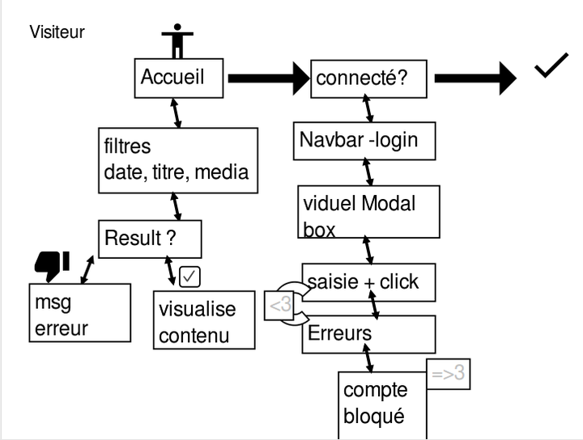
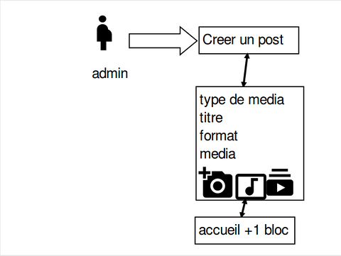
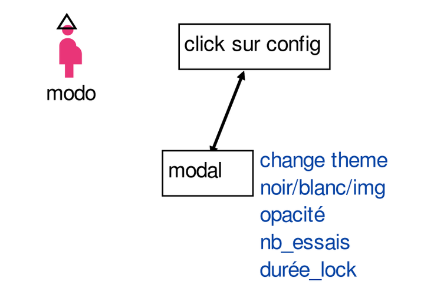
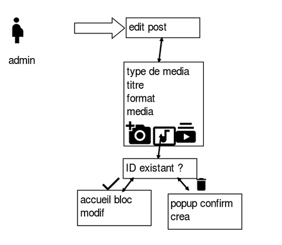
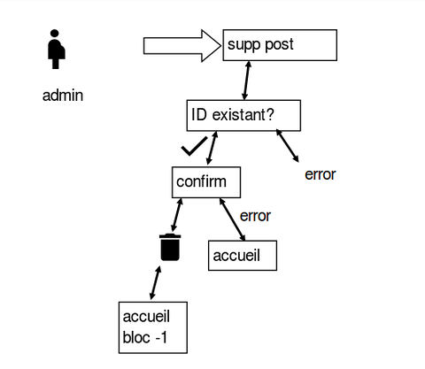
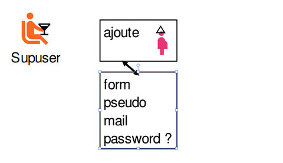

# PROJET-PHP
Dans un premier temps nous avons etudié le besoin du client, comprendre le BPML et l'UML et le mettre en place.

Besoin du client : application fonctionnel sur la mixité.

UML:

utilisateur: 

	#id 

	email-unique

	mot de passe

	pseudo-unique 

	clé

Bloc:

	#id 

	titre 

	media-img

	media-video

	media-audio

	date

	format-Enum  (format prédefini) 

Rôle:

	#id

	nom

BPML:

Scénarios possible: 

Dans un 2ème temps écrire les scénarios avec Gherkin.

Comprendre comment utiliser Gerkin et l'installer. 

	